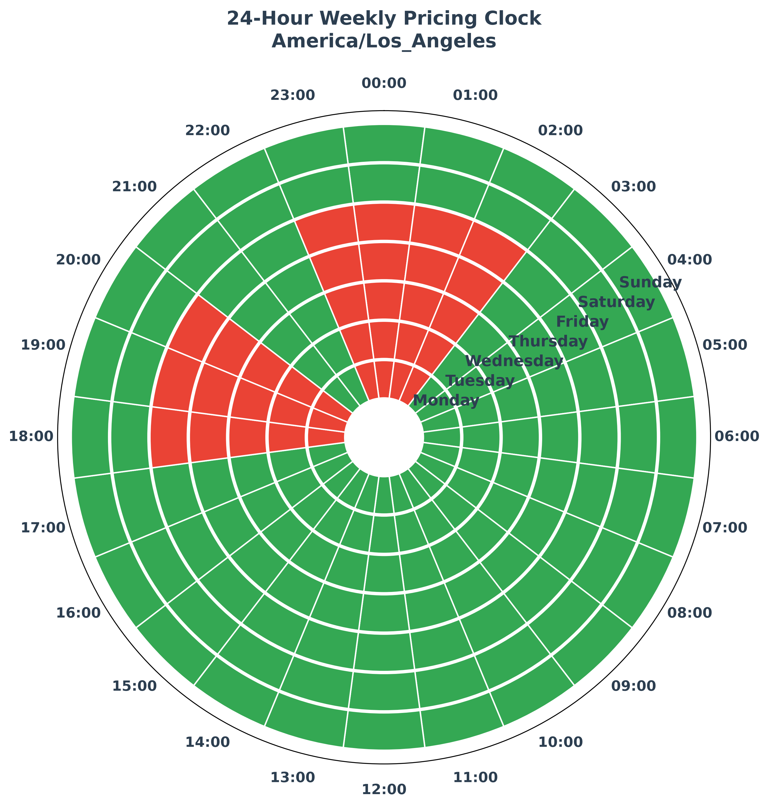
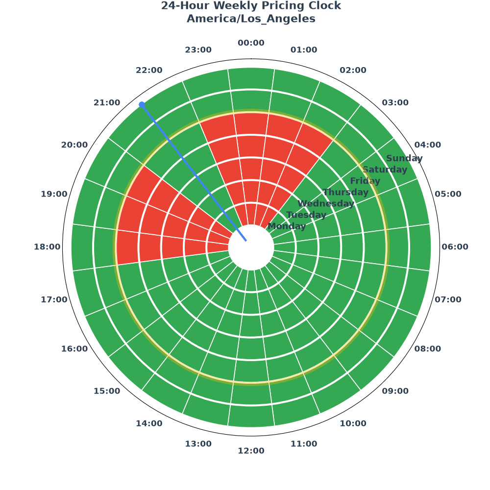

# 24-Hour Weekly Pricing Clock


A polar chart visualization rendering a 24-hour weekly pricing clock (peak/off-peak hours across all seven days) for a given timezone. Defaults to the system timezone, with a list of common timezones to choose from.

## Preview



Animated preview (`pricing_clock.gif` — day-ring highlight + current-time marker pulse):



## Quick Start

```bash
source .venv/bin/activate
python main.py
```

Interactive prompt asks for a timezone (Enter accepts the system default). Generates `perfected_pricing_clock.png` (300 DPI) and opens a preview window.

## CLI Flags

| Flag | Description |
|---|---|
| `--tz America/Tijuana` | Skip the prompt and use a specific timezone |
| `--animate` | Render `pricing_clock.gif` — looping animation (day-ring highlight + current-time marker pulse) |
| `--headless` | Save output without opening a window (scripts/CI) |

Examples:

```bash
python main.py --tz Europe/Berlin                 # static PNG, no prompt
python main.py --animate --tz America/Los_Angeles  # animated GIF, no prompt
python main.py --animate --headless                # GIF, no window
```

## Customization

All tunables live at the top of `main.py` under `# --- Configuration ---`:

- `PEAK_HOURS` — peak pricing windows (local time)
- `PEAK_COLOR` / `OFF_PEAK_COLOR` — slice colors
- `HOUR_LABEL_PAD`, `HOUR_LABEL_VA`, `HOUR_LABEL_HA` — hour label spacing and alignment
- `GIF_FPS`, `GIF_DPI`, animation colors — GIF output

## Requirements

- Python 3.14 (`.venv` provided)
- `numpy`, `matplotlib`, `Pillow` (see `requirements.txt`)
  - See [Polar plot](https://matplotlib.org/stable/gallery/pie_and_polar_charts/polar_demo.html) documentation.